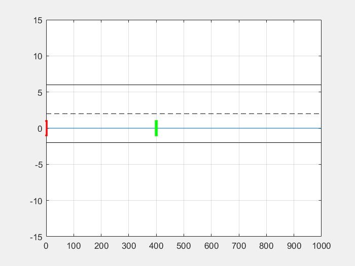

# Dynamic Obstacle Avoidance Using Adaptive MPC

##### Group Members: 
* Gianvincenzo Daddabbo
* Gaetano Gallo
* Alberto Ruggeri
* Martina Tedesco
* Alessandro Toschi
## 1. Description

The basic idea behind our project is to implement a system for dynamic obstacle avoidance using an adaptive Model Predictive Control. 
In the simulated environment, the vehicle model is expected to encounter and safely avoid the dynamic obstacles along its way. 
When an obstacle is not present ahead of the autonomous vehicle, it is expected to follow a predetermined path.

## 2. Repo Structure

* Documentation: contains the report and other significant documents
* Code: contains the Matlab code, the Simulink block scheme and the relative generated C code 

## 3. Required tools
### MATLAB R2019a or newer
* Curve Fitting Toolbox
* Automated Driving Toolbox
* Model Predictive Control Toolbox

### Simulink 9.3 or higher
* Simulink Test
* Embedded Coder

### STM32CubeMx
### STM32CubeIDE
### STM32 - MAT

